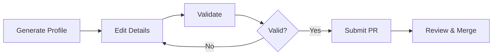
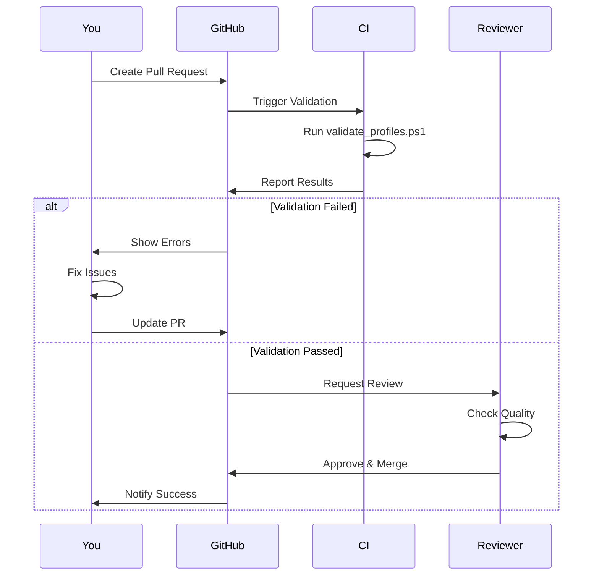

# Contributing to Dev Work Insights

Thank you for your interest in contributing!
This guide will help you create a high-quality developer profile.

## 📋 Table of Contents

- [Quick Start](#quick-start)
- [Detailed Guide](#detailed-guide)
- [Security & Branch Protection](#security--branch-protection)
- [Commit & PR Rules](#commit--pr-rules)
- [Profile Structure](#profile-structure)
- [Quality Guidelines](#quality-guidelines)
- [Submission Process](#submission-process)

---

## 🛡️ Security & Branch Protection

We enforce strict security and quality controls to maintain repository integrity.

### Branch Rules

- **Direct Pushes Restricted**: You cannot push directly to `main`.
- **Pull Requests Required**: All changes must go through a PR.
- **Reviews Required**: At least 1-2 approvals needed before merging.
- **Status Checks**: All CI/CD checks (validation, linting, security) must pass.
- **Linear History**: We use squash or rebase merging.

---

## 📝 Commit & PR Rules


### Commit Messages
We follow the **Conventional Commits** specification:

`<type>(<scope>): <short description>`

**Types:**

- `feat`: New feature (e.g., adding a profile)
- `fix`: Bug fix
- `docs`: Documentation only
- `chore`: Maintenance/Refactoring

**Example:**
`feat(profile): add pankaj-kumar profile`

### Pull Request Requirements

1. **Title**: Must match commit style (e.g., `feat: add pankaj-kumar profile`)
2. **Template**: Fill out the PR template completely.
3. **Validation**: Ensure all local scripts pass before opening.

---

## 🚀 Quick Start



### Four Simple Steps

1. **Generate** - Run the generator script
2. **Edit** - Fill in your details
3. **Validate** - Check for errors
4. **Submit** - Create a pull request

---

## 📝 Detailed Guide

### Step 1: Generate Your Profile

**Windows:**

```cmd
.\generate.bat
```

**Linux/macOS:**

```bash
./generate.sh
```

**What happens:**

- Script prompts for your full name
- Creates `contributors/firstname-lastname.md`
- Pre-fills template with your name

### Step 2: Edit Your Profile

Open `contributors/yourname.md` and fill in:

#### Required Fields

| Field | Description | Example |
|-------|-------------|---------|
| **Name** | Your full name | Pankaj Kumar |
| **Role** | Current position | Senior Full-Stack Developer |
| **Tech Stack** | Primary technologies | React, Node.js, PostgreSQL |
| **Work Style** | How you prefer to work | Remote-only, async-first |
| **Learning** | How you learn | Books, courses, OSS |
| **Projects** | Real work you've done | 1-3 detailed projects |
| **Career Goals** | What you're looking for | Early-stage startup, remote |
| **Links** | Your online presence | GitHub, portfolio, LinkedIn |

#### Optional Fields

- **Tools & Automation** - Scripts, workflows, productivity hacks
- **Personality** - Hobbies, interests, fun facts

### Step 3: Validate Your Profile

**Windows:**
```powershell
.\scripts\validate_profiles.ps1
```

**Linux/macOS:**
```bash
./scripts/validate_profiles.sh
```

**Validation checks:**

- ✓ All required fields present
- ✓ No placeholder text
- ✓ No sensitive information
- ✓ Proper file naming
- ✓ Valid Markdown format

**Fix any errors shown**, then re-validate.

### Step 4: Submit Your Profile

```bash
# Create a new branch
git checkout -b add-yourname

# Add your profile
git add contributors/yourname.md

# Commit with clear message
git commit -m "Add [Your Name] profile"

# Push to your fork
# Push to your fork
git push origin add-yourname
```

**Note:** If possible, sign your commits (`git commit -S ...`) for verified status.

**Then create a Pull Request on GitHub.**

---

## 📊 Profile Structure

### Complete Template

```markdown
## Name: [Your Full Name]

**Role / Position:** [Your Current Role]  
**Primary Tech Stack:** [Languages, frameworks, tools]  
**Work Style / Preferences:**  
- [Remote/On-site/Hybrid]
- [Communication style]
- [Team size preference]
- [Development methodology]

**Learning / Growth:**  
- **Books**: [Technical books]
- **Courses**: [Online courses]
- **Resources**: [Blogs, communities]
- **AI Tools**: [How you use AI]

**Recent / Notable Projects:**  
- **[Project Name]** ([Year]):  
  [Description]. Tech: [Stack]. [Impact/metrics].

**Career Aspirations:**  
[What you're looking for]

**Favorite Tools / Automation:**  
- [Custom scripts]
- [Productivity tools]

**Fun / Personality Insight:** *(Optional)*  
[Hobbies, interests]

**Links:**  
- GitHub: [URL]
- Portfolio: [URL]
- LinkedIn: [URL]
```

---

## ✅ Quality Guidelines

### Be Specific, Not Generic

<!-- markdownlint-disable MD013 -->
| ❌ Generic | ✅ Specific |
|-----------|------------|
| "Passionate developer" | "Full-stack developer specializing in real-time collaboration tools" |
| "Love learning" | "Learning Rust via 'The Rust Book' and building a CLI log parser" |
| "Team player" | "Prefer async-first communication, 4-hour deep work blocks, small teams (5-10)" |
| "Built web apps" | "Built e-commerce platform with Next.js, reduced load time by 60%, 10k+ daily users" |
<!-- markdownlint-enable MD013 -->

### Include Real Projects

**Good project description:**

```markdown
- **Real-Time Collaboration Platform** (2024):  
  Built document collaboration tool using React, WebSockets, and OT algorithms. 
  Supports 50+ concurrent users. Tech: React, Node.js, Redis, PostgreSQL. 
  Reduced conflict resolution time by 80%.
```

**Bad project description:**

```markdown
- Built various web applications using modern technologies
```

### Share Actionable Tools

**Good:**

```markdown
- Custom Python script to sync GitHub issues with Notion
- Tmux + Neovim setup with LSP for Go and TypeScript
- Alfred workflows for quick documentation lookup
```

**Bad:**

```markdown
- Use productivity tools
```

---

## 🚫 What NOT to Include

### Sensitive Information

- ❌ Personal email addresses
- ❌ Phone numbers
- ❌ Home addresses
- ❌ Salary information
- ❌ API keys or credentials
- ❌ Confidential company information

### Safe to Include

- ✅ Professional social media (GitHub, LinkedIn)
- ✅ Public portfolio websites
- ✅ Public blog posts
- ✅ Open-source project links
- ✅ General location (city/country)

---

## 📐 File Naming Convention

**Format:** `firstname-lastname.md`

**Rules:**

- All lowercase letters
- Hyphens for spaces
- No special characters
- `.md` extension

**Examples:**

- ✅ `pankaj-kumar.md`
- ✅ `john-smith.md`
- ✅ `maria-garcia.md`
- ❌ `Jane_Doe.md`
- ❌ `john.smith.md`
- ❌ `JOHN-SMITH.md`

---

## 🔄 Submission Process



### What Happens After Submission

1. **Automated Validation** - GitHub Actions runs validation script
2. **Review** - Maintainer reviews your profile for quality
3. **Feedback** - You may receive suggestions for improvement
4. **Merge** - Once approved, your profile is merged
5. **Published** - Your profile is now live!

---

## 🎯 Profile Quality Checklist

Before submitting, ensure:

- [ ] All required fields filled in
- [ ] No placeholder text (e.g., `[Your Name]`)
- [ ] At least 1-2 detailed projects
- [ ] Specific, not generic descriptions
- [ ] No sensitive information
- [ ] At least one link provided
- [ ] File named correctly (`firstname-lastname.md`)
- [ ] Validation passes with no errors
- [ ] Markdown formatting is correct

---

## 💡 Tips for a Great Profile


### 1. Be Authentic
Share your real work style and preferences, not what you think people want to hear.


### 2. Be Specific
Include actual tools, scripts, and workflows you use daily.


### 3. Be Current
Update your profile as you grow and learn new things.


### 4. Be Helpful
Share insights that others can learn from.


### 5. Be Professional
Keep it focused on technical work and career goals.

---

## ❓ FAQ


### Can I update my profile later?
Yes! Simply edit your file and submit a new PR.


### What if I don't have many projects?
Quality over quantity. One detailed project is better than five generic ones.


### Can I include side projects?
Absolutely! Side projects often show passion and initiative.


### How long should my profile be?
Aim for 50-100 lines. Be comprehensive but concise.


### What if validation fails?
Read the error messages carefully and fix the issues. Re-run validation until it passes.

---

## 🆘 Getting Help

- **Check the sample**: See [contributors/pankaj-kumar.md](contributors/pankaj-kumar.md)
- **Read the README**: See [README.md](README.md)
- **Open an issue**: Ask questions on GitHub Issues
- **Review existing profiles**: Learn from other contributors

---

## 📚 Additional Resources

- [README.md](README.md) - Repository overview
- [WORKFLOW.md](WORKFLOW.md) - Quick 4-step guide
- [QUICK_REFERENCE.md](QUICK_REFERENCE.md) - Command reference
- [contributors/pankaj-kumar.md](contributors/pankaj-kumar.md) - Example profile

---

**Thank you for contributing to Dev Work Insights!**

Your profile helps build a valuable resource for the developer community.
