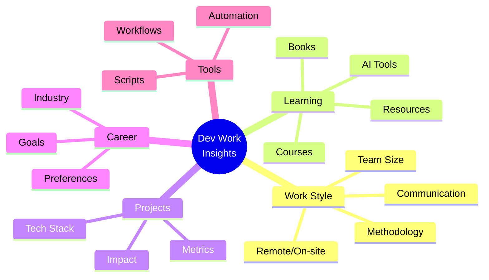
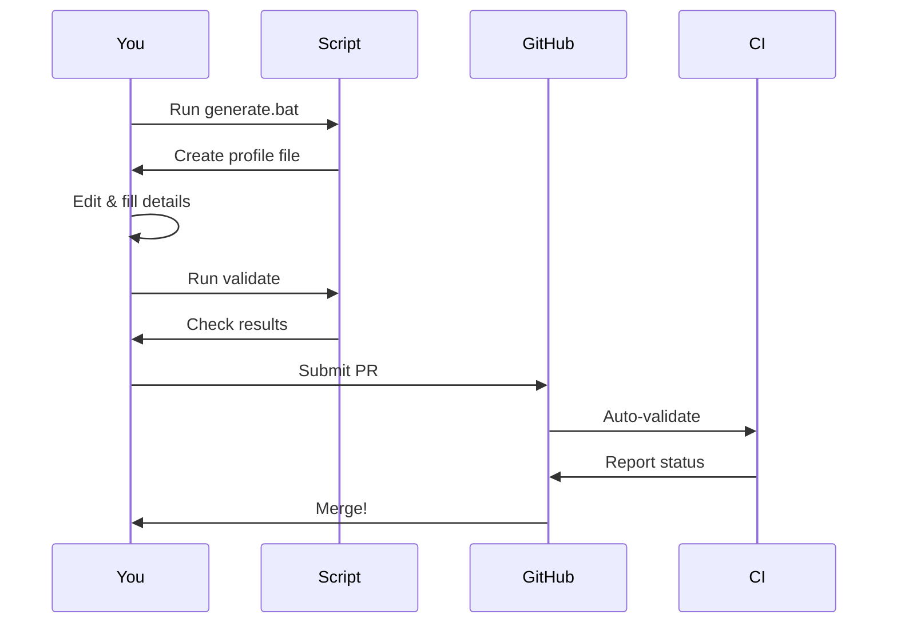

# Dev Work Insights

<div align="center">

[](https://github.com/yourusername/dev-work-insights/graphs/contributors)
[](LICENSE)
[](CONTRIBUTING.md)

**A curated collection of developer work insights, projects, and learning habits.**

[Quick Start](#-quick-start) • [Contributing](CONTRIBUTING.md) • [Examples](#-examples) • [FAQ](#-faq)

</div>

---

## 🎯 What is This?

A structured repository where developers share **real work insights**:



### Why It Matters

Traditional profiles don't show:
- ✗ How developers actually work
- ✗ What tools they use daily
- ✗ Their learning approach
- ✗ Real project impact

**This repository fills that gap.**

---

## 🚀 Quick Start

### For Contributors


**Windows:**
```cmd
.\generate.bat
```

**Linux/macOS:**
```bash
./generate.sh
```

**Full Guide:** [CONTRIBUTING.md](CONTRIBUTING.md)

### For Recruiters & Founders

1. Browse [`contributors/`](contributors/) directory
2. Filter by tech stack, work style, or location
3. Review detailed project descriptions
4. Connect via provided links

---

## 📊 Profile Structure

| Section | Description | Example |
|---------|-------------|---------|
| **Name & Role** | Current position | Senior Full-Stack Developer |
| **Tech Stack** | Primary technologies | React, Node.js, PostgreSQL, AWS |
| **Work Style** | Preferences | Remote-only, async-first, small teams |
| **Learning** | Growth approach | Books, courses, OSS contributions |
| **Projects** | Real work | E-commerce platform, 10k+ users |
| **Career Goals** | What's next | Early-stage startup, developer tools |
| **Tools** | Automation | Custom scripts, productivity workflows |
| **Links** | Online presence | GitHub, portfolio, LinkedIn |

---

## ✨ Examples

### Good vs Generic

| ❌ Generic | ✅ Specific |
|-----------|------------|
| "Passionate developer" | "Full-stack developer specializing in real-time collaboration tools using React and WebSockets" |
| "Always learning" | "Learning Rust via 'The Rust Programming Language' and building a CLI tool for log parsing" |
| "Team player" | "Prefer async-first communication, 4-hour deep work blocks in mornings, small teams (5-10 people)" |
| "Built web apps" | "Built e-commerce platform with Next.js, reduced page load by 60%, handles 10k+ daily users" |

### Sample Profile

See [contributors/pankaj-kumar.md](contributors/pankaj-kumar.md) for a complete example.

---

## 🎨 What Makes a Great Profile?

### 1. Specific Work Style
```markdown
✅ "Remote-only, async-first communication (Slack over meetings), 
    prefer 4-hour deep work blocks, small teams (5-10), 
    VSCode with Vim keybindings"
```

### 2. Real Projects with Impact
```markdown
✅ "Real-Time Collaboration Platform (2024):
    Built document collaboration tool using React, WebSockets, 
    and OT algorithms. Supports 50+ concurrent users. 
    Reduced conflict resolution time by 80%."
```

### 3. Actionable Tools & Automation
```markdown
✅ "Custom Python script to sync GitHub issues with Notion,
    Tmux sessions with automated window layouts,
    Alfred workflows for quick documentation lookup"
```

---

## 🔧 Repository Features

### Zero Dependencies
- **Windows**: Built-in PowerShell
- **Linux/macOS**: Built-in Bash
- **No installation required**

### Automated Validation
- Checks required fields
- Detects sensitive information
- Validates file naming
- Ensures quality standards

### Cross-Platform
- Works on Windows, Linux, macOS
- Same workflow everywhere
- Native scripts only

---

## 📁 Repository Structure

```
dev-work-insights/
├── README.md                    # This file
├── CONTRIBUTING.md              # Detailed contribution guide
├── WORKFLOW.md                  # Quick 4-step guide
├── QUICK_REFERENCE.md           # Command reference
├── LICENSE                      # MIT License
├── generate.bat                 # Windows launcher
├── generate.sh                  # Linux/macOS launcher
├── contributors/                # All developer profiles
│   └── pankaj-kumar.md             # Sample profile
└── scripts/                     # Validation & generation tools
    ├── generate_profile.ps1    # Windows generator
    ├── generate_profile.sh     # Linux/macOS generator
    ├── validate_profiles.ps1   # Windows validator
    ├── validate_profiles.sh    # Linux/macOS validator
    └── TEMPLATE.md             # Profile template
```

---

## 🤝 Contributing

We welcome all technical contributors!

### Quick Contribution Flow



**See [CONTRIBUTING.md](CONTRIBUTING.md) for detailed instructions.**

---

## ❓ FAQ

### Who can contribute?
Any technical contributor: developers, engineers, data scientists, DevOps engineers.

### What if I'm a junior developer?
Perfect! Share your learning journey and projects. Quality matters, not seniority.

### Can I update my profile later?
Yes! Simply edit your file and submit a new PR.

### How long does review take?
Usually 24-48 hours. Automated validation is instant.

### What if validation fails?
Read the error messages, fix the issues, and re-validate. It's that simple.

---

## 📊 Use Cases

### For Developers
- Discover peers with similar interests
- Find new tools and automation ideas
- Explore career paths
- Share your work and get visibility

### For Recruiters
- Understand real work styles
- See actual project impact
- Find culture fit, not just skills
- Connect with developers directly

### For Founders
- Find developers who match your team
- Understand work preferences
- See real-world experience
- Build diverse teams

### For AI & Analytics
- Structured, parseable data
- Consistent format
- Rich insights
- Trend analysis

---

## 🌟 Why Contribute?

- **Visibility** - Showcase your real work and skills
- **Networking** - Connect with like-minded developers
- **Opportunities** - Get discovered by founders and recruiters
- **Community** - Help build a valuable resource
- **Learning** - Discover new tools and approaches

---

## 📜 License

This project is licensed under the MIT License - see the [LICENSE](LICENSE) file for details.

---

## 🔗 Quick Links

- [Contributing Guide](CONTRIBUTING.md) - Detailed instructions
- [Workflow Guide](WORKFLOW.md) - Quick 4-step process
- [Quick Reference](QUICK_REFERENCE.md) - Command cheatsheet
- [Sample Profile](contributors/pankaj-kumar.md) - Example profile to follow

---

<div align="center">

**Made with ❤️ by developers, for developers**

[⬆ Back to Top](#dev-work-insights)

</div>
